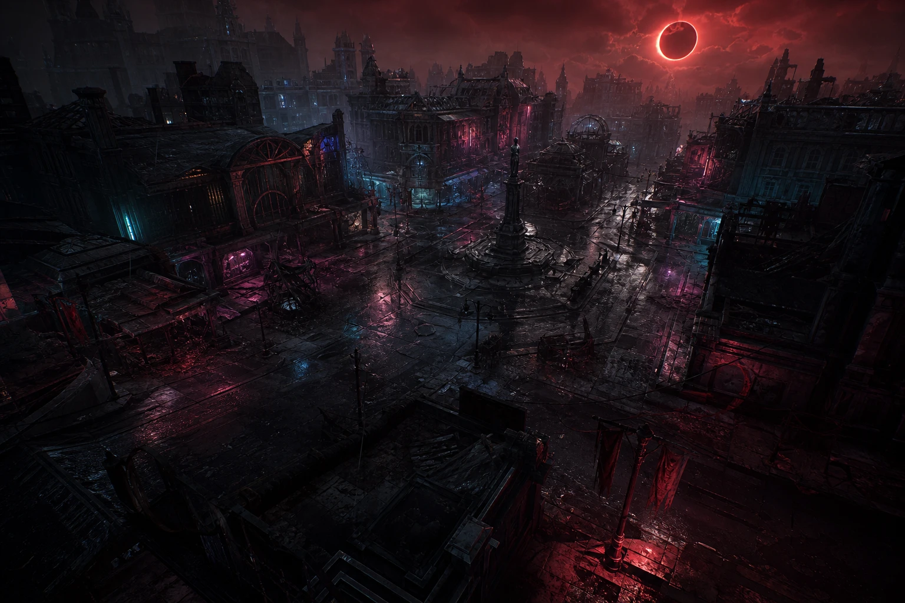
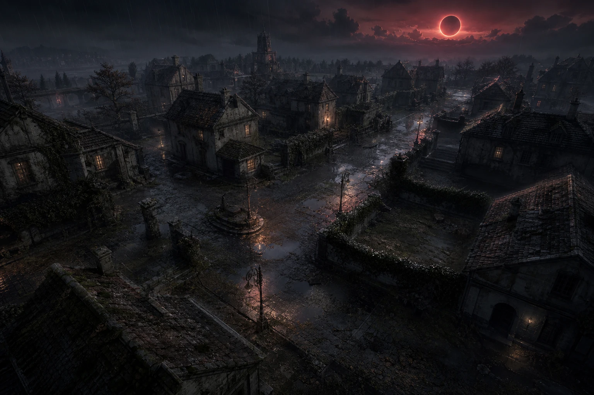
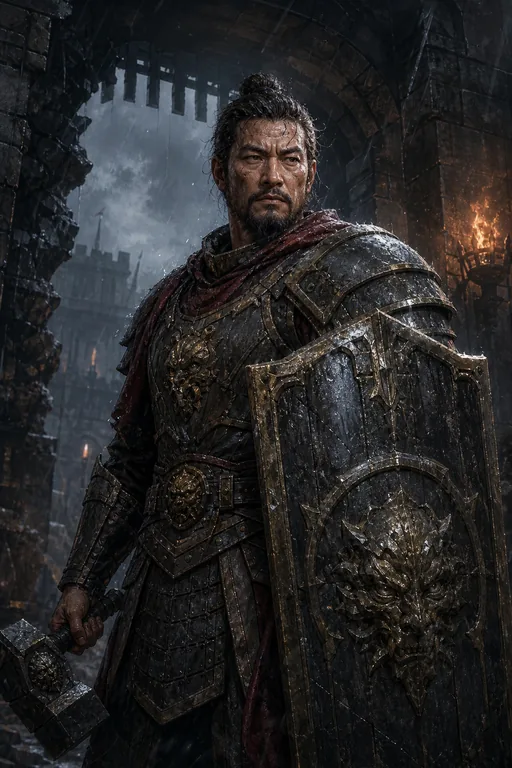
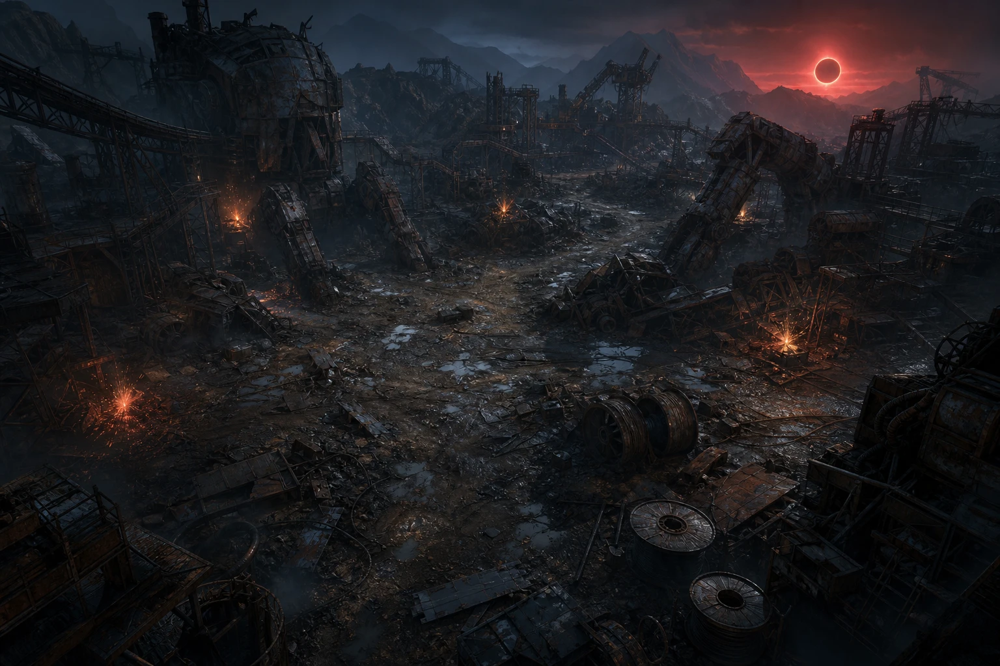
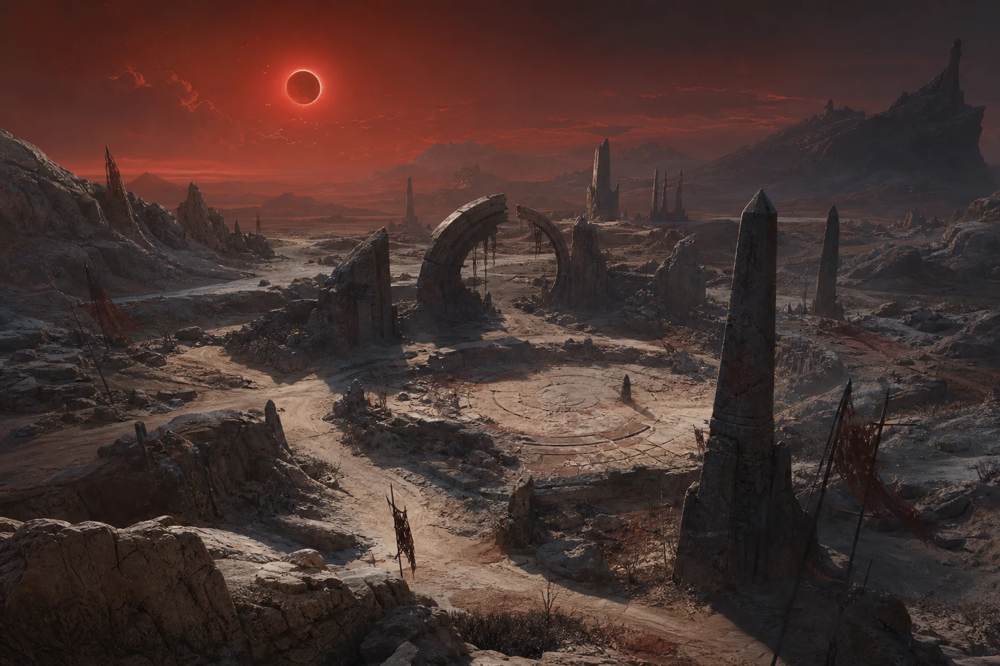
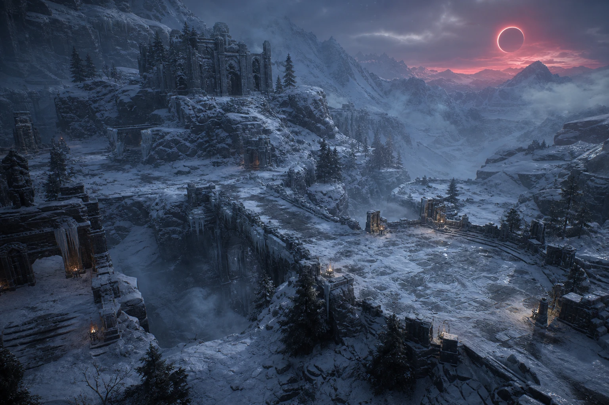
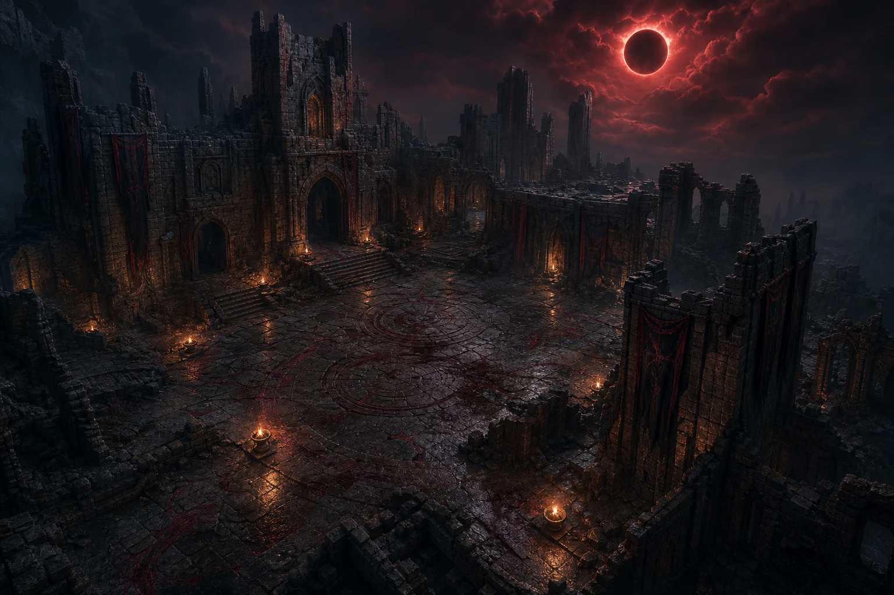
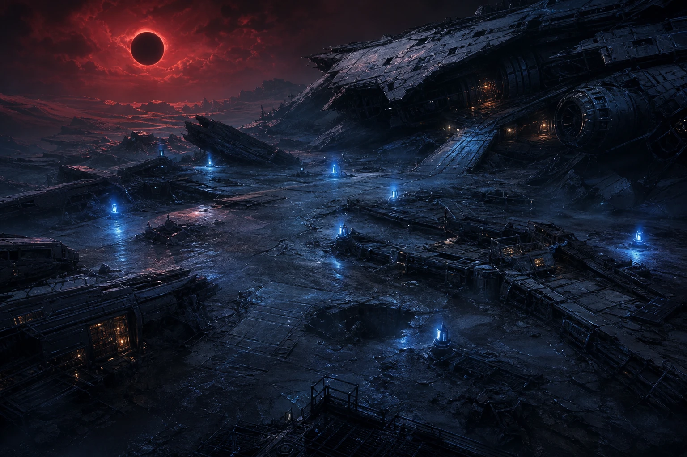
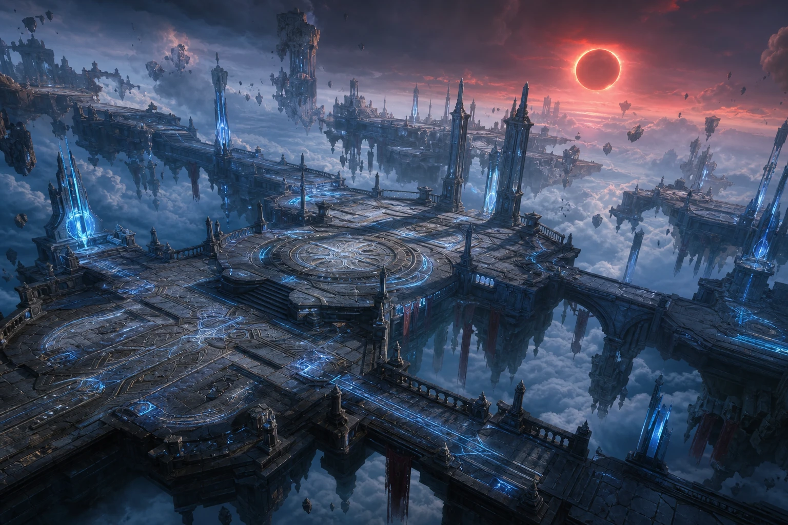

# 《深红中继》

> 一部与游戏《深红中继（CRIMSON RELAY）》同源的短篇小说。城市、职业、怪物、地图与任务链皆取自游戏设定；故事里的规矩，也就是玩家在灰港中继站里遵循的规矩。

---

## 序章 深红月的规则

关于深红月，灰港里流传着三条规矩，据说和这座世界一样古老。

第一条：**城外的名字都是打出来的。** 你降临时只有一副职业的铠甲和一个没人认得的呼号，其余一切——身手、气力、身上的每一件遗物——都要从九道门外的猎场里一寸寸夺回来。

第二条：**独行者走不远。** 城外的怪物不是死物，它们体内凝着红月的微光。裂隙体倒下的那一刻，那束光会碎裂开来，最狠的一刀吸走最亮的一束，逸散的光尘则顺着空气渗进近旁同伴的铠甲缝，温养他们的血肉——灰港人管这叫“分摊”。可光尘飘不远，也过不了传送门：谁跑出了耳目可及的范围，谁越到了另一块土地，谁就分不到那一缕暖。所以红月照见的每一段路，都是为四个人准备的。

第三条，守门人芦婆从不写在登记簿上，只在夜里低声说给新来的人听：**别在夜里数门。因为第十道门总会出现。**

RELAY-07 是听着这三条规矩活下来的。这是他的故事，也是每一个曾在灰港点亮第一圈灯的人的故事。

---

## 第一章 灰港的月影

深红月升起时，灰港中继站的灯刚好亮完第七圈。

灯塔不是为船准备的。这里已经很久没有海，旧海床上长满黑色的金属草，风一吹，便像千万片薄刃互相摩擦。灯塔的光穿过尘雾，照向城外九道门。每一道门后面，都是一块被月光改写过的土地：暮居的街区、旧都的废墟、北境的回山、锈蚀的废料场、赤潮的沙海、霜脊的山线、坠落的城堡、失落的星港，以及悬在云上、谁也没真正登顶过的天城。

守门人芦婆说，别在夜里数门。

因为第十道门总会出现。

那天晚上，来自天城的通讯断了。中继站的水晶屏幕先变成灰白，接着浮出一行没有署名的字：

> 深红月正在回传。请交出最后一名继承者。

没人知道“继承者”是谁。灰港里的人只知道，城外的怪物突然停止了互相猎杀。裂隙体站在暮居边缘，抬头望着同一个方向；旧都的暮牙兽也不再追逐商队，而是把耳朵贴在地面，仿佛地下有什么东西正在醒来。

直到一个陌生人走进中继站。

他没有带行李，只有一把还没有名字的刀。刀柄上嵌着一枚暗红色的月片，光芒微弱得像将熄的炭火。

“呼号？”芦婆问。

陌生人看向灯塔：“还没有。”

“那就先活下来。城外的名字，都是打出来的。”

他在登记台前写下：RELAY-07。

就在笔尖离开纸面的一刻，远处传来钟声。

不是灰港的钟。

是地底的钟。

---

## 第二章 四个人的队伍

  
  
  
  

RELAY-07 选择了先锋的铠甲——一副被称作“绯岚”样式的重刃装。据说最早穿它的人，在中继站陷落那夜独自扛住了城门，刀刃上至今留着裂隙的灼痕。他学的是同一种打法：把冲势变成震荡，一步踏进敌群，把力量砸出去。

第一道门外，裂隙体比传闻中更快，黑色的爪子在地面划出蓝色火花。第一次攻击落空，第二次几乎擦过他的喉咙。

他没有逞强，退回门边，按下通讯器。

“有人组队吗？”

回应他的是三个不同方向的声音。

“我在旧都，十分钟到。”那是逐风者阿霁，声音轻得像箭离弦。她曾是荒原信使，替灰港把信件送去那些连门都没有的远方；据说她见过比这座世界更空旷的地方，也带回过一封始终没能送达的信——收信人所在的门，在她赶到之前就永远关上了。此后她留在中继站，因为这里是她所知唯一还肯替“送不到的东西”留一条路的地方。

“我在灰港。”导能者澜生说，“别把怪引进安全区。”他能听见星能潮汐——那是别人听不见的、藏在红月背后的一种低鸣。天赋从不是白给的：那低鸣从不停歇，像终年的耳鸣，有时会拼凑成半句话，仿佛谁在极远处一遍遍呼叫，却始终等不到回答。他学会与它共处，也学会在它突然变响时格外小心——那往往意味着，附近有什么东西正在醒来。

最后一个声音沉默了很久，才传过来：“壁垒者，铁砧。算我一个。”他曾是采掘队的护卫。至于他的盾为什么总带着一道补过的裂痕，他从不说；只有芦婆知道，很多年前的一次塌方里，他把最后一个位置让给了队里最年轻的掘工，自己的盾却没能撑到救援赶来。从那以后，他习惯把队友挡在身后，把伤痕留给自己——仿佛只要盾还举着，就没有人会再从他身边消失。

四个人在暮居门口汇合。阿霁先冲进怪群，绕着裂隙体划出一圈银光；铁砧举盾站在圈心，任凭爪击砸在盾面；澜生把星核般的蓝白光束投向远处，RELAY-07 则在三人的空隙里挥刀。

第一头裂隙体倒下时，它体内那束红月微光炸开来。RELAY-07 只觉得一缕温热顺着刀锋爬上手臂，钻进铠甲缝里，在皮肉下静静化开——像喝了一口热汤。逸散的光尘飘向三步之内的三人，各自渗进他们的甲缝。四个人的仪表几乎同时亮了一下。

“这就是分摊。”澜生说，“别走散，别越门。光尘飘不远。”

他们很快摸清了这座世界更细的规矩：一支队伍最多认证四个席位，正好是能互相照应、又不至于把那缕暖稀释到无谓的数目。杀敌者独得最亮的一束，同图、近旁、活着、还在线的队友各自分一缕——四个条件缺一不可。跨了图，掉了线，或是倒下了，那一缕就与你无关。

夜里在暮居和旧都之间清怪，RELAY-07 第一次感到身体在变。不是仪表上的数字——是听觉先变得锐利，能分辨出暮牙兽扑来前爪尖蹭过金属草的细响；接着是铠甲，明明一片没卸，扛在肩上却轻了几分，仿佛血肉自己长出了托住它的力气。落步更稳，出刀更利。红月的光尘攒够了，一个人就会往上“长”一层。灰港人把这叫升级，可只有亲历的人知道，那更像蜕壳。

也是在这几夜，他们各自摸到了第十级。中继站的水晶屏上第一次跳出一个陌生的词：**转生**——底下缀着一行灰着的小字，写明它要到千级、也就是这条路的尽头，才会亮起。

“把一身气力都还回去，”澜生念着屏上的字，眉头动了动，“换永久的根骨、更长的命、更狠的每一刀。”

“还回去？”阿霁皱眉，“我们才刚有点样子。”

铁砧盯着那行字看了很久：“愿意走远路的人，才敢先退一步。”

没有人当场决定。他们把这个选项记在心里，继续往外走——因为路还很长，长到足够想清楚，也长到足够让他们明白：有些一步，是被逼着才敢退的。

---

## 第三章 锈王

越往外，红月越低，猎场的脾气也越大。

暮居的边缘出过一次险。那天他们贴着最外圈清低级的裂隙体，澜生的耳鸣毫无征兆地拔高了一个调子。“不对——”他话音未落，一头本该在旧都深处游荡的岩角兽越过了看不见的等级线，低头冲了过来。等级带从不是画在地上的线，而是彼此重叠的潮：低处的滩涂里，偶尔会漫进深水的浪。那头岩角兽比他们高出太多，一次撞击就把 RELAY-07 掀翻在金属草里，铠甲下的骨头嗡嗡作响。是铁砧横过来一盾，替他挡下第二撞，四人才踉跄着退回门内。

“进门前，先比一比自己配不配。”铁砧扶起他，声音闷在盔里，“红月不看你想去哪儿，只看你扛不扛得住。”

从那以后，他们学会了在踏进每一道门前，先掂量等级、装备和药剂——像信使掂量一段路的死活。

北境回山的风是干的，卷着碎石打在面罩上沙沙作响。岩石缝里钻出岩角兽，棘甲爬兽把自己缩成带刺的球从坡顶滚下，撞在盾上迸出火星。就是在这里，草原之主**棘颚兽**第一次挡住去路——血条长得像一堵墙。四个人耗了整整一刻钟才把它放倒，掉落的金币和一瓶复苏露，让他们头一回尝到“主之名”的分量。

再往外，是锈蚀废料场。

那味道先于一切扑来：刺鼻的铁锈混着陈年机油，吸一口，舌根都发涩。脚下没有土，只有层层叠叠的废钢，每一步都发出被踩弯的、刺耳的呻吟。远处传来沉重的轰鸣——不是风，是**废钢巨兽**体内齿轮咬合的声音，一头接一头，像整座废料场都装着一颗生锈的心脏在跳。

任务把他们引向了更深处，也引到了**锈王**面前。

那不是一头兽，是一座会动的坟。整座废料场的残骸——断掉的桁架、报废的巨兽外壳、不知多少代猎人的碎甲——全被某种意志拼在了一起，站起来时遮住了半轮红月。它开口不是吼，是无数金属互相摩擦的尖啸，尖得澜生当场跪了下去，双手死死捂住耳朵：那声音和他脑中的低鸣是同一个频率，此刻被放大了千百倍。

“撑住！”RELAY-07 冲上去。

可这一次，力量不够。

锈王的每一次挥击都带起一整片废钢。阿霁的箭钉在它身上像钉进一堵墙；澜生的星火束打上去只崩开几点火花；RELAY-07 连劈十余刀，那道血条几乎没动。他们不是不勇，是这具身体里攒下的气力，到此为止了。

它抬起由半截桁架构成的手臂，朝铁砧砸下。

铁砧举盾迎了上去——那是他一贯的位置，圈心，最前，替所有人挡下最狠的一下。

盾面裂开的声音，比锈王的尖啸更让人心颤。

不是补过的那道旧痕，是整面盾，从中央炸成了几瓣。冲击穿过碎盾灌进他的手臂、肩、胸，把他整个人抛了出去，砸进废钢堆里，久久没有起来。那一瞬间，RELAY-07 在铁砧眼里看见的不是疼，是很多年前那种熟悉的、眼睁睁看着什么从身边消失的神情。

“撤！”阿霁嘶声喊。澜生连滚带爬地挪过去，从怀里掏出复苏露，一滴银液按进铁砧碎裂的胸甲——他这才从鬼门关边缘睁开眼。四个人架着彼此，一路退回废料场入口，锈王没有追，只是转过那颗生锈的头，像看几粒不值得追的尘。

门内，谁都没有说话。铁砧盯着自己空荡荡的左臂——盾没了，连带着他这些年一直举着的那个念头，仿佛也裂了一道缝。

“力量不够。”他终于开口，声音哑得几乎听不清，“不是不够勇。是根，不够深。”

RELAY-07 想起了水晶屏上那个一直被他们记在心里、却没人敢点的选项。

他抬起头：“那就先退一步。”

---

## 第四章 转生

那行灰字亮起来的时候，已经是很久以后了。

千级的顶点上没有风声，也没有欢呼。经验条涨到头就不再动了——红月的光尘照样落，照样钻进骨头缝里，却再也无处可去。四个人站在天城的檐上往回看，那条从暮居一路烧到这里的路，短得不像走了那么久。屏上那个词终于不灰了。

转生不是屏幕上的一次点击。

中继站地底有一口池，池水是红月的颜色。芦婆说，愿意的人才下去；下去的人，出来时便不再是原来那副骨头。

RELAY-07 第一个走下去。红水没过胸口的刹那，他攒了这么久的气力开始被一寸寸剥离——听觉重新变钝，铠甲重新压回肩上那种陌生的沉，出刀的手竟有些发虚。那是一种近乎被掏空的痛，像把长进血肉里的东西硬生生拔出来。他几乎想爬出去。

可就在最空的那一刻，池底有什么顺着骨髓涌了上来。不是气力——是**密度**。他的骨头在重新生长，比原来更坚、更沉、更致密；血肉在旧痕之上织出新的筋络。等他从红水里站起来，仪表上的等级归了零，低级怪一只都杀不动了；可他握了握拳，知道有什么东西永远地留下了。他重新挥刀，刀风不再激越，落步却比以往任何一次都稳——像一棵把根往下又扎深了一层的树。

阿霁跟着下去了。澜生犹豫最久——他怕重塑会连同那持续了半生的耳鸣一起改写。可当他从红水里出来，低鸣还在，只是他终于能在它之上，听见更远的东西。最后是铁砧。他在池边站了很久，才把那只失了盾的手臂浸进红月色的水里。“这一次，”他低声说，像在对很多年前那个没能救下的人说，“我要能扛得住。”

然后是漫长的重来。

他们从暮居的裂隙体重新打起，一层一层地长回去。可这一次不同：同样的岩角兽再也掀不翻 RELAY-07；同样的一段路，走起来比记忆里轻。有人不止转生了一次——每一次都痛，每一次出来，根都更深一寸。他们不再急着抵达某座地图，而是学会了在一张图里把骨头养沉，再带着更硬的自己往外走。

重来的路，也让他们把先前赶着穿过的猎场，一寸寸看清了。

赤潮沙海里，细沙红得像凝住的血，在脚踝边缓缓流动，走一步陷半步。风裹着咸腥的红月气息，烈日把铠甲晒得如同熔炉，隔着甲片都能烫出汗来。沙下藏着**沙喉**，张口便是一整片下陷的漏斗，连光都往里坠。

霜脊山线是另一个极端。寒冷像一只手，攥住四肢，连出刀都慢了半拍。呼出的白雾瞬间在面罩上结成霜，视野蒙上一层白翳，得不时抬手去刮。霜眼祭兽的目光能让血凝住，山巅的**霜角**每一次喷吐的白雾，都在他们甲上镀出一层脆冰。

坠落城堡的地基里，**墓行者**沉默地列队行进，脚步声整齐得像某种早已停摆的仪仗；失落星港的甲板上，**舰魂**拖着一整艘船的残念巡航，走过之处，空气里都是金属冷却后的余温。每一头都比前一头更高、更厚、更慢，也更致命。而每一件从它们身上落下的**遗物**——**霜月刀·霁澜**、**凝神之戒**、**长明之链**——都刻着陌生却庄重的名字。黑市商人影三说，那是“上一轮月光留下的东西”。他们换上遗物的那一刻，刀更利，命更长，仿佛借到了前人未尽的一点气力。

而在所有这些之前，他们绕回了锈蚀废料场。

回去那天，坤铁把一面新盾拍在铁砧怀里。锻匠一边收工具一边碎碎念：“又是你。上回那面我打了三天三夜，你倒好，一下午就还我一堆废铁——省着点用啊，我这炉子也不是红月开的……”话虽难听，那面盾的边缘却比旧的厚出一指，分明是照着“再也不许碎”打的。铁砧没接话，只是把盾扣上失而复得的左臂，扣得很紧。

锈王还站在废料场深处，还是那座会动的坟，还是那阵能钻进骨头的尖啸。

可这一次，尖啸响起时，澜生只是皱了皱眉——他在那频率之上，稳稳地放出了星火。这一次，阿霁的箭钉进锈王的关节，崩开的火星里带出了它体内的红光。这一次，锈王抬起半截桁架的手臂朝铁砧砸下，盾面迎上去——

没有碎。

冲击顺着新盾散开，震得铁砧连退三步，脚下的废钢被踏得深深陷进去，人却稳稳立着。他从盾后抬起头，第一次没有把伤痕独自吞下去，而是低吼一声：“上！”

RELAY-07 踏着他让开的缝冲进去，一刀落在锈王胸口那颗生锈的“心脏”上。这一刀的刀风没有从前激越，却带着转生后那种沉到骨子里的重。血条，第一次，肉眼可见地塌了下去。

战斗很久，很难。锈王倒下的时候，整座废料场的轰鸣都静了一瞬，仿佛那颗生锈的心脏终于停跳。四个人瘫坐在废钢上，谁也没力气欢呼。铁砧摩挲着那面完好无损的新盾，忽然笑了，笑声在废铁之间回响，像有人在很远的地方，终于敲开了一扇一直没能敲开的门。

“值了。”他说。

失去过，才知道什么叫扛得住。

---

## 第五章 双魂者

在霜脊与城堡之间，他们遇见了第五个人。

他独自站在雪线上，披着一件谁也认不出的旧袍，一手是黎明的金光，一手是深渊的寒霜。他自称玄晓，红月之下诞生的双魂者。

“组队吗？”阿霁照例先问，随即顿住——他们的队伍，已经满了四席。

玄晓却摇头，答的是另一件事：“不必替我腾位子。红月的账本记不全我。”

他们后来才懂这句话。一支队伍在猎场上只认四个“已认证”的席位，多一个，光尘便分不匀。可玄晓身上住着两条魂线，光辉与深渊此消彼长，红月的法则始终判不定他究竟是谁——于是把他记成了两个各半的实体，无论哪条线主宰，占的都只是半席。半席算不进认证的四席，却又不曾真正掉线；他像一道浮席，贴着队伍的光尘走，却从不在账本上写满一整行。“所以我能跟着你们，”玄晓说，“又不必挤掉谁。这是双魂唯一的好处。”

他们也很快看懂了那两条线。**光辉线**时，他掷出贯穿一切的圣枪，治愈并加固自己的魂力护障；**深渊线**时，同样的手势却化作三向的蚀寒弹、永夜的冰环。哪条线主宰他，取决于一样叫**名誉**的东西——它随他每一次出手而摆动，向他所选择的一端一点点滑去。这摆动是看得见的：他铠甲上的纹路会随之流转，用光辉时漫上一层暖金，用深渊时又褪成幽冷的冰蓝，金与蓝在甲缝里此消彼长，像潮水在两岸之间来回。

那分寸并不总由得他。城堡外的一场恶战里，墓行者的队列合围上来，铁砧的血被压到了最后一格。玄晓那一刻的名誉正深深压在深渊一侧——顺势放出的冰环足以冻住半支队列，替所有人解围。可那样，铁砧就来不及救了。

RELAY-07 看见玄晓的甲纹在金与蓝之间剧烈地抖。他咬着牙，硬生生把手势扳回光辉线——名誉逆着惯性往回滑，暖金一寸寸吞回冰蓝，那过程像逆着水流游泳，玄晓的脸都白了。黎明的光落在铁砧身上，魂力护障重新亮起，把他从鬼门关边缘拽了回来。冰环没有放出，半支墓行者的队列因此扑了上来，是阿霁和 RELAY-07 用命填了那道口子。

“你本可以更轻松。”战后 RELAY-07 说。

玄晓望着自己重新泛起暖金的甲纹，很久才答：“这世上没有免费的狠厉。深渊那一击是快，可每用一次，我就离‘会为了快而舍下同伴的那种人’近一点。”他顿了顿，“力量不难得。难的是决定要成为使用它的哪一种人。”

那一夜，通讯频道里此起彼伏。有人在旧都喊人清任务，有人在废料场求一瓶复苏露，有沉稳的守望者报出精准的坐标，有欢快的术士笑着说自己又把黑夜提前点亮了。灰港从不寂静——九道门外，永远有别的队伍在打自己的名字。玄晓听着，第一次没有走开。

---

## 第六章 第十道门

他们在坠落城堡的最深处，看见了第十道门。

它没有传送标记，也没有守卫。门框由中继站灯塔的同一种黑金属制成，门上嵌着一轮倒悬的深红月。RELAY-07 伸手触碰门面时，月片刀柄突然发热。

“奇怪，”玄晓忽然说，甲纹上的金蓝都静了下来，“这里不数席位。四个也好，五个也罢，门都收。”——第十道门不属于九猎场，也就不受那四席之法的管辖；它只认走到这里的人，不问来了几个。

门里传出一个声音：

“你终于回来了。”

“我来过这里？”

“你只是忘了。”

门后没有房间，只有一片倾斜的石廊。石廊尽头立着六个影子，五个守卫和一个披着旧中继站制服的高大人形。它的面罩上刻着灰港早已停用的编号：RELAY-00。

“深红月不是天灾。”RELAY-00 说，“它是一封信。每隔一千年，月光会把所有记忆送回地面。你们的城市、职业、任务，都是为了让继承者学会如何把信送出去。”

“送给谁？”阿霁问。这个词让她的手指微微收紧——她比谁都懂一封送不到的信有多重。

RELAY-00 抬起手。石廊顶部裂开，露出看不见尽头的红色天空。天空之外，有无数微弱的灯，像另一座比世界更大的灰港。

“送给还在等中继的人。”

“那怪物呢？”玄晓问，声音里两条线同时震动，“那些裂隙体、暮牙兽、被我们杀了一路的东西，也是信的一部分？”

“它们是回声。”RELAY-00 说，“是上一次没能送达的记忆，碎在了地面上。你们杀死它们，只是把碎片一片片捡回来。”

澜生忽然抬起头。他脑中那半生不散的低鸣，此刻终于拼成了完整的一句话——原来它一直是这封信的一角，在极远处一遍遍呼叫，等一个能听见的人。他眼眶发热：“我听了半辈子……原来不是幻听。”

监察者发动了攻击。

五名守卫同时展开阵列。阿霁切开左侧的风墙，澜生把跃迁技能砸在守卫脚下，铁砧举着那面再没碎过的盾挡住首领第一轮冲撞，玄晓在光辉与深渊之间飞快切换，替所有人挡下最狠的几下——这一次，他不再为扳回光辉线而犹豫。RELAY-07 则看见自己的影子从刀身上站了起来。

那道影子没有攻击怪物。

它指向石廊深处的一块空白石碑。

石碑上没有名字，只有一个等待书写的位置。

---

## 第七章 中继

战斗持续了很久。怪物的等级跟随他们的平均力量生成，仿佛副本早就知道他们会走到这里，也知道他们究竟养了多深的骨头。这座密库据说全世界同时最多容得下三十二个，谁若在一刻钟内打不完，就会被送回中继站，从头再来。

铁砧的盾这一次没有碎，可他的手臂被震得几乎握不住。阿霁的箭袋见了底。澜生的法力只够再施放一次技能——而那层由法力撑起的魂力护障，正一点点变薄。玄晓的名誉在光与暗之间剧烈摇摆，最后停在了光辉线上：他把最后一点魂力都用来续住众人的命，甲纹上的暖金亮得几乎透明。RELAY-07 的血量跌到最后一格时，他听见灰港的钟声从门外传来。

第七圈灯光同时熄灭。

“如果我们输了呢？”阿霁问。

“一刻钟后，副本会把我们送回城里。”澜生说，“可只要还有一滴复苏露，倒下的人就能在原地站起来，接着打。这一回，没人会真的从彼此身边消失。”

铁砧握紧那面完好的盾：“那就别让它等到一刻钟。”

五个人把最后一次攻击交给了 RELAY-07。

他没有看监察者的血条，而是看向那块石碑。月片从刀柄上脱落，飘到空白处，像一枚终于找到归宿的印章。

他写下五个名字。

灰港的灯塔骤然亮起。

红色月光穿过石廊，穿过九张猎场，穿过城堡、星港与天城，最后抵达天空之外那座等待已久的城市。监察者的面罩裂开，里面没有脸，只有一盏小小的中继灯。

“信已送达。”它说。

然后，所有影子都化成了光。

玄晓在光里站了很久。他体内的两条线第一次同时安静下来——不是谁压倒了谁，而是黎明与深渊终于愿意共用一具身体；甲纹上的金与蓝不再彼此吞噬，而是并肩流淌，像终于握手言和的两岸。“原来送信的人，”他轻声说，“也会顺便把自己送达。”

澜生闭上眼。脑中的低鸣，第一次，停了。

---

## 尾声 灰港仍在

他们回到灰港时，天还没有亮。

芦婆在灯塔下摆了五碗热汤，仿佛早知道他们会回来。铁砧照例又去找了坤铁——不是修盾，这次是道谢，锻匠嘴上骂骂咧咧，转身却红了眼眶。阿霁把空箭袋挂在门边，从怀里取出那封始终没能送达的旧信，就着灯塔的光看了很久，终于轻轻放进了中继站的回传槽——她知道，只要中继还在线，就总有一条路。澜生则发现自己的通讯器里多了一条来自天城的信号，清晰得没有一丝杂音。玄晓没有走：他把旧袍脱下来，换上一件灰港的制服，第一次给自己写下了呼号。

来自天城的信号只有一句话：

> 中继站仍在线。请继续守住月光。

RELAY-07 看向城外。九道门依旧安静，第十道门已经消失，像从未存在过。悬空天城的顶端，那位从不轻易现身的**深红督军**仍在等着——任务链的最后一环“深红的终局”永远不会真正完结，可以一遍遍重新挑战。有些名字，本就是用来反复打的。

但在很远的地方，一只新的裂隙体睁开了眼睛。它体内，一束新的红月微光，正静静凝聚。

灰港的第一圈灯亮了。

有人在通讯频道里问：“组队吗？”

这一次，RELAY-07 先回答了。

“组。”

---

> **创作署名**：本篇小说与《深红中继（CRIMSON RELAY）》游戏同源，由项目贡献者 **GMyhf**、**Claude**（Anthropic）、**Codex**（OpenAI）共同完成。城市、职业、怪物、地图与任务链皆取自游戏设定。
